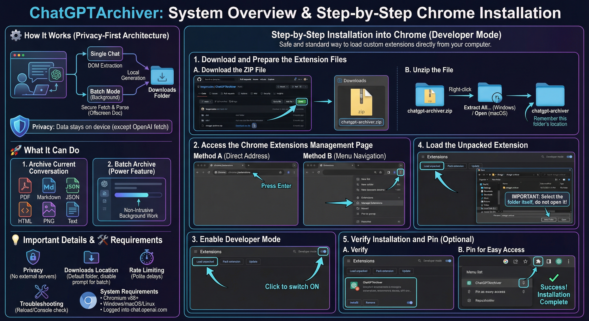

# ChatGPTArchiver

**ChatGPTArchiver** is a powerful Chrome extension that allows you to archive your ChatGPT conversations in multiple formats, including PDF, PNG, Markdown, JSON, HTML, and plain text. It supports both single-chat archiving and **batch archiving** of multiple conversations. This project has been re-engineered for Manifest V3 compliance and enhanced features, building upon the excellent work of `pionxzh/chatgpt-exporter`.

## 🚀 Features

-   **Multiple Formats:** Archive to PDF, PNG, Markdown, JSON, HTML, or Text.
-   **Batch Archiving:** Select multiple conversations from the sidebar and archive them all at once.
-   **High Fidelity:** Preserves code blocks, formatting, and timestamps.
-   **Privacy First:** Runs entirely in your browser. No data is sent to external servers.

## 📥 Installation

### For Users (Corporate / Standard)
We have a detailed, step-by-step guide for installing this extension in a corporate environment:
👉 **[Read Installation Guide](docs/USER_GUIDE.md)**

**Quick Summary:**
1.  Download the **[chatgpt-archiver.zip](dist/chatgpt-archiver.zip)** file from the `dist` folder in this repository.
2.  Unzip the file.
3.  Go to `chrome://extensions` in Chrome.
4.  Enable "Developer mode" (top right).
5.  Click "Load unpacked" and select the unzipped folder.

### For Developers
If you want to contribute or modify the code, please read our **[Developer Guide](DEVELOPER.md)**.

## 📖 Usage

1.  **Open ChatGPT:** Go to [chat.openai.com](https://chat.openai.com).
2.  **Open the Extension:** Click the extension icon in your browser toolbar.
3.  **Select Mode:**
    -   **Current Chat:** Archive the currently open conversation.
    -   **Batch Archiving:** Select multiple conversations from the list.
4.  **Choose Format:** Click your desired format (e.g., PDF, Markdown).
5.  **Archive:** Click the "Archive" button.

## 🤝 Contributing

We welcome contributions! Please see **[CONTRIBUTING.md](CONTRIBUTING.md)** for details on how to get started.

## 📄 License

This project is licensed under the **[MIT License](LICENSE)**.
